# Tauranga Coastal LiDAR — QC & 1 m ArcGIS Products

Independent portfolio demonstration using LINZ 3D Coastal Mapping data, focused on coastal LiDAR QC, ArcGIS Pro raster products, and vertical-datum interpretation.

## Showcase

| | | |
|:---:|:---:|:---:|
| **Ground–seabed DTM**<br>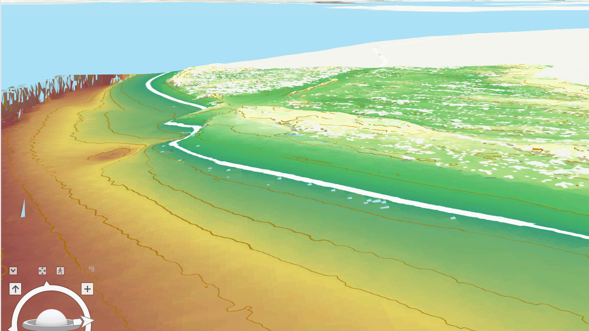<br><sub>Brown = deep, yellow = high · −17.45 → +11.26 m</sub> | **RGB true colour**<br>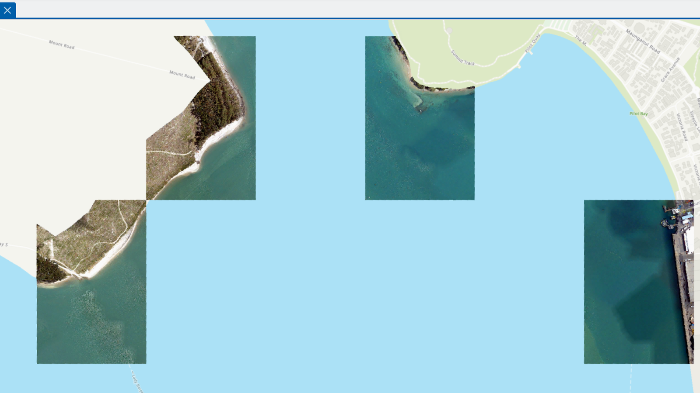<br><sub>Three-band attributes at 1 m</sub> | **Mean intensity**<br>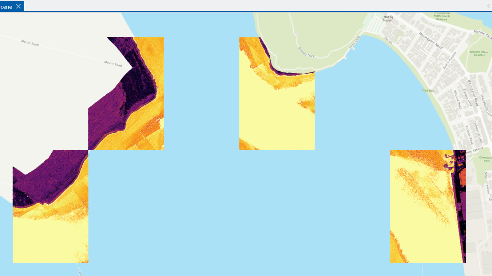<br><sub>Dark = low, yellow = high · 642 → 65,530</sub> |
| **Point density**<br>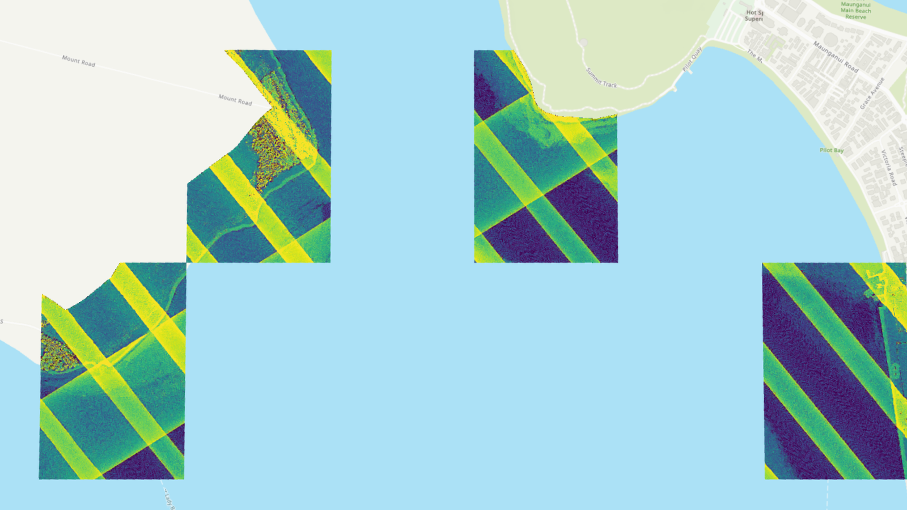<br><sub>Purple = sparse, yellow = dense · 1 → 315</sub> | **Elevation profile**<br>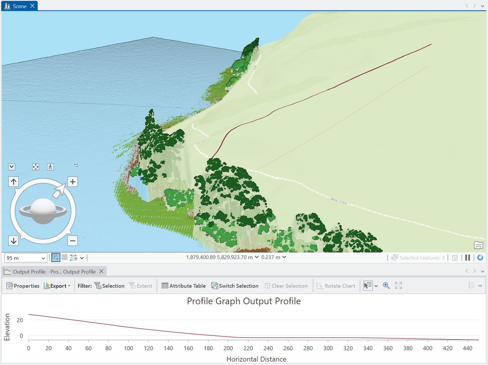<br><sub>Sulphur Point across channel</sub> | **3D classification**<br>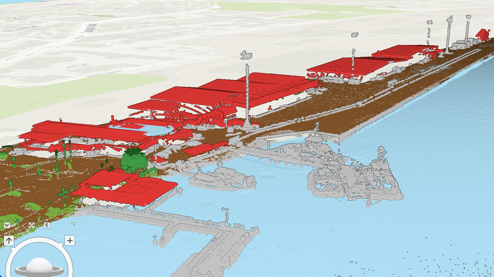<br><sub>Ground, veg, building, seabed</sub> |

---

## Project summary

A hands-on exercise on real LINZ coastal LiDAR data: I downloaded 4 coastal LiDAR tiles (40.75 million point records) around Tauranga Harbour, ran first-line quality checks, and generated 1 m raster products in ArcGIS Pro — all while documenting what the data can and cannot support.

**Key numbers:** 4 tiles · 40.75 M point records · 1 m raster cell size · LAS 1.4 PDRF8 · NZTM2000 / NZVD2016

**What I did:**
- Audited classifications, withheld flags, synthetic water points, elevation ranges and intensity
- Built ground–seabed DTM, DSM, RGB, intensity, density and hillshade rasters from the LAS dataset
- Ran an elevation profile across the shipping channel

**What I did *not* claim:** formal vendor acceptance, independent accuracy, Chart Datum transformation, or a verified intertidal boundary — those require reference data and are listed as follow-up work.

> **Key QC finding:** 13.0 M synthetic water-surface points (class 42) all share intensity = 65,530 — demonstrating why point-population filtering matters before interpreting LiDAR-derived intensity products.

## Scope and source data

| Item | Detail |
|---|---|
| Source layer | LINZ Data Service · `d3Y5Qkvcp5Q5vXf` (New Zealand Coastal LiDAR Point Cloud) |
| File structure | Source files: COPC LAZ (LAS 1.4 / PDRF8); working copies converted to uncompressed LAS for analysis |
| Horizontal CRS | NZGD2000 / New Zealand Transverse Mercator 2000 (NZTM2000) · EPSG:2193 |
| Vertical CRS | New Zealand Vertical Datum 2016 (NZVD2016) · EPSG:7839 |
| File sizes | ~390 MB compressed LAZ across 4 tiles; ~1.55 GB as converted LAS |
| Decoded point-record times | 28 Jan – 18 Feb 2025 UTC (Adjusted Standard GPS Time; stored value + 10⁹ s, GPS–UTC leap-second offset applied) |
| Scan angle | Raw PDRF8 values −3249 to +3249; at 0.006° per unit, this corresponds to −19.494° to +19.494° |
| Licence | CC BY 4.0 |

### Tile layout

Four selected tiles that do not provide continuous harbour coverage; ~480 m gaps occur between parts of the sample. Each tile is 480 m × 720 m. Tile-frame total ≈ 1.38 km²; enclosing rectangle ≈ 4.15 km² — neither is an effective measured footprint.

## First-line checks

### Per-tile record summaries

| Tile | Records | Mean records/m² | Ground (class 2) | Seabed (class 40) | Synthetic water (class 42) | Synthetic share | Withheld share | Min class-40 Z (m) |
|---|---:|---:|---:|---:|---:|---:|---:|---:|
| 1206 | 10,304,404 | 29.8 | 1,411,241 | 1,004,015 | 1,615,638 | 15.7% | 35.6% | −5.40 |
| 1208 | 9,465,971 | 27.4 | 65,976 | 555,503 | 4,126,195 | 43.6% | 47.3% | −15.33 |
| 1305 | 12,476,448 | 36.1 | 1,140,609 | 583,583 | 3,794,917 | 30.4% | 42.7% | −10.48 |
| 1310 | 8,503,988 | 24.6 | 662,235 | 381,955 | 3,463,997 | 40.7% | 41.2% | −17.45 |

Mean density divides all delivered records by each tile's bounding rectangle. The numerator includes synthetic, withheld, delivery-labelled noise and multiple returns. It does **not** measure compliance with a minimum survey-density requirement.

### Flag summary

| Flag | Count | Share |
|---|---:|---:|
| Withheld records | 16.98 M | 41.7% |
| Synthetic records (class 42) | 13.00 M | 31.9% |

Classes present: 1 unclassified, 2 ground, 3 low vegetation, 4 medium vegetation, 5 high vegetation, 6 building, 7 low noise, 40 seabed, 42 synthetic water surface, 45 (bathymetric noise as labelled in this delivery).

### Extreme elevations are not a depth validation

The all-record elevation range is approximately −117.6 to +86.8 m NZVD2016. The most negative record (tile 1305, −117.56 m) and the maximum (+86.79 m) are both labelled class 7 low noise. The minimum among delivered class-40 seabed records is −17.45 m NZVD2016 — a class-specific sample statistic, not a verified harbour depth.

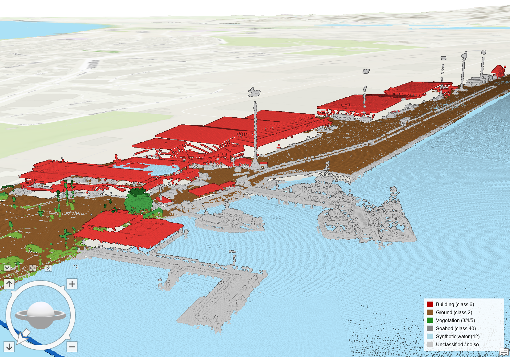

## QC finding: uniform intensity on synthetic water surfaces

All **13.0 M class-42 records have intensity = 65,530**. The export metadata defines class 42 as a synthetic water surface used in refraction processing. This establishes a uniform stored attribute; why that value was assigned has not been established.

| Population | Records | Mean intensity | Median intensity | P95 intensity |
|---|---:|---:|---:|---:|
| All records (as delivered) | 40,750,811 | 34,545 | — | 65,530 |
| Excluding class 42 only | 27,750,064 | 20,028 | 16,009 | 61,479 |

"Excluding class 42 only" still includes withheld and noise-labelled records, so p95 = 61,479 is not a "clean" real-return intensity. Intensity is a system-specific return-magnitude attribute, not calibrated reflectance. The unsigned 16-bit field limit is 65,535; the observed 65,530 alone is not a saturation test.

The existing ArcGIS intensity raster still includes synthetic class 42 — roughly 43.8% of valid cells read 65,530. A screened-return raster would require a separate, documented regeneration.

## ArcGIS Pro workflow

The product set was generated in ArcGIS Pro from the four converted LAS tiles. Supporting Python QC (laspy/numpy) audited classifications, flags, intensity statistics and raster properties.

| Step | Tool | Parameters | Output |
|---|---|---|---|
| 1. Build LAS dataset | LAS Dataset → Add files | 4 converted LAS tiles; NZTM2000 + NZVD2016 | `coastal.lasd` |
| 2. Classification symbology | Symbology → Classify | Class 2 ground, 6 building, 40 seabed, 42 synthetic water | 3D scene |
| 3. DTM | LAS Dataset To Raster | Elevation · Binning Average · 1 m · Void Fill None · ground+seabed | `DTM_1m_nofill.tif` |
| 4. DSM | LAS Dataset To Raster | Elevation · Binning Maximum · 1 m · All Points | `DSM_1m.tif` |
| 5. RGB | LAS Dataset To Raster | Value = RGB · Binning Average · 1 m | `RGB_1m.tif` |
| 6. Intensity | LAS Dataset To Raster | Value = Intensity · Binning Average · 1 m (display: histogram equalisation) | `intensity_1m.tif` |
| 7. Density | LAS Point Statistics As Raster | Point Count · 1 m (display: histogram equalisation) | `density_1m.tif` |
| 8. Hillshade | Hillshade | Azimuth 315° · Altitude 45° | `hillshade_1m.tif` |
| 9. Land–seabed DTM colour | Symbology → Stretch | Purple→blue→green→yellow; 0 m NZVD2016 contour as elevation reference | DTM 3D + 2D |
| 10. Profile | Analysis → Exploratory 3D Analysis → Elevation Profile | Line from Sulphur Point across channel | Elevation vs distance |
| 11. Vertical exaggeration | Command Search (Alt+Q) | Vertical Exaggeration = 1.00 | True-scale 3D relief |

## Products

Five ArcGIS rasters, 1 m cells, 2,880 × 1,440, bounds E 1,877,920–1,880,800 / N 5,828,640–5,830,080.

| Product | Method | Notes |
|---|---|---|
| Ground–seabed DTM | Elevation · Binning Average · Void Fill None | Classes 2 + 40; NoData cells remain gaps, not interpolated |
| DSM candidate | Elevation · Binning Maximum | Includes water-related and synthetic class-42 surfaces |
| Point-count raster | Point Count · 1 m | Non-withheld counts, includes synthetic class 42 |
| Mean intensity raster | Intensity · Binning Average | Includes synthetic class 42 (mixed population) |
| Gridded point RGB | RGB · Binning Average | Three-band source attributes aggregated to cells |

### Gallery

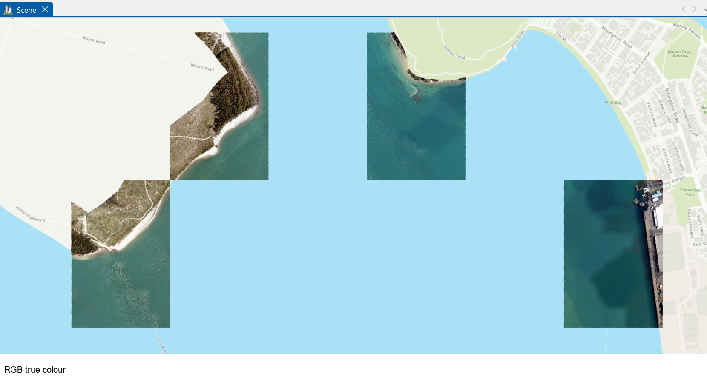

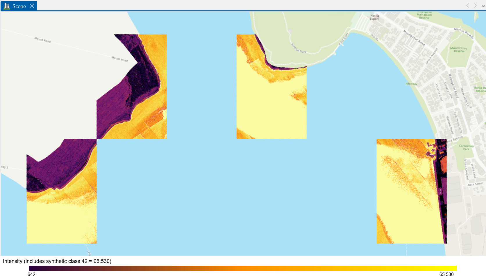

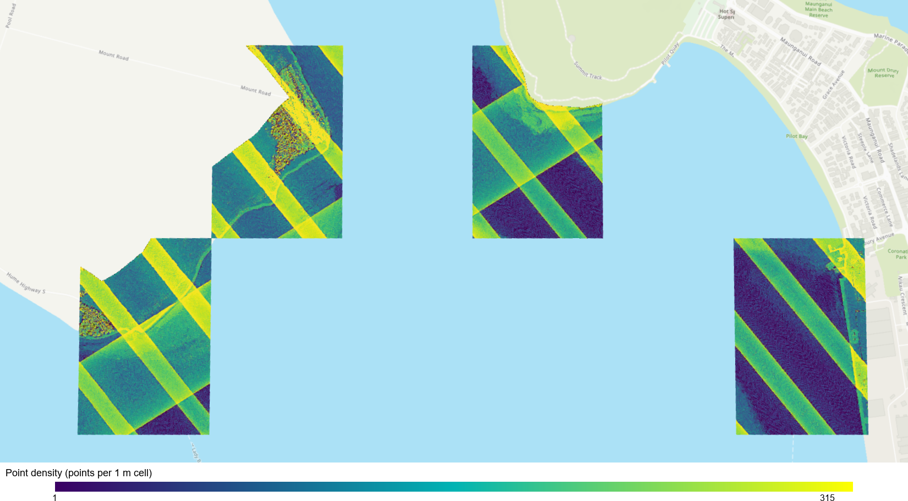

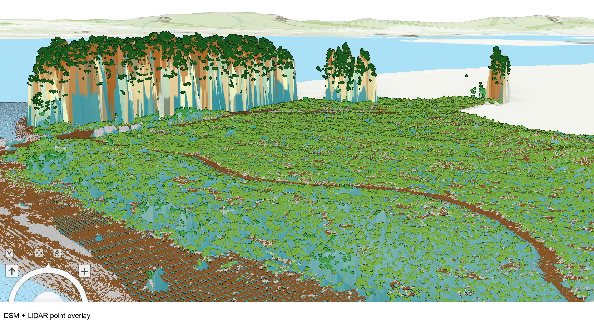

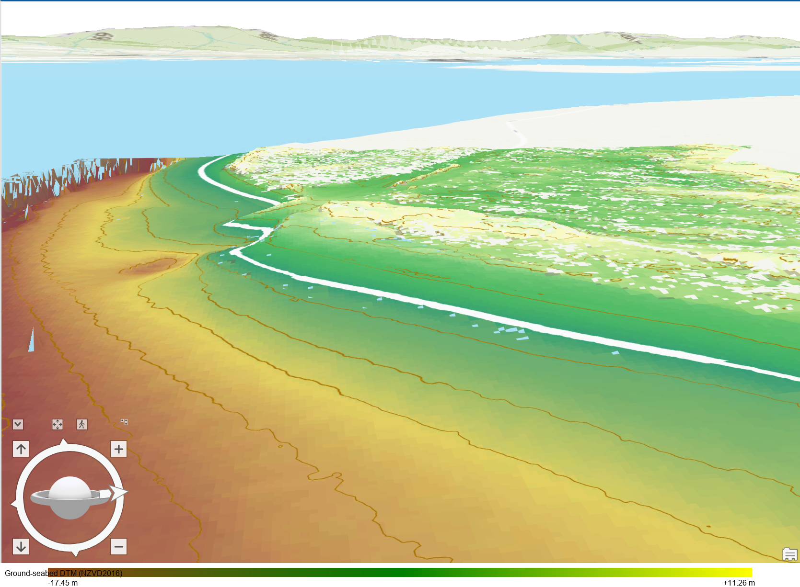

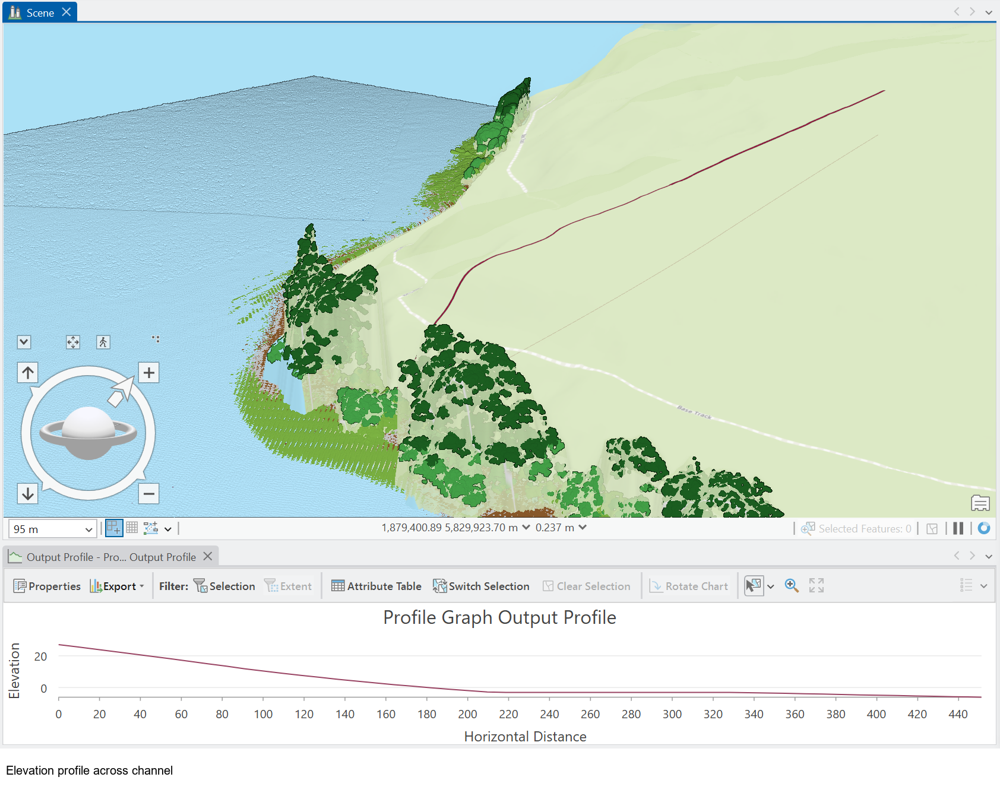

Combining classes 2 and 40 demonstrates a ground–seabed elevation product within one source survey and one vertical reference. It does **not** complete fusion with independently acquired multibeam data, resolve a Chart Datum conversion, or establish continuous harbour coverage.

## Vertical datums and tidal interpretation

The source elevations are referenced to **NZVD2016**, a gravity-based national height reference defined independently of local sea level. Tauranga tide predictions state heights above local **Chart Datum**. A zero-height NZVD2016 contour is an elevation contour; it cannot be assumed to identify a shoreline or tidal boundary.

No NZVD2016–Chart Datum offset, MHWS elevation, surveyed drying line or verified intertidal area is calculated in this report. LINZ defines Tauranga Chart Datum as **4.103 m below benchmark BC 84 (B309)**; a local connection requires verifying the applicable B309 NZVD2016 height, connection record, uncertainty and spatial use.

## Problem log

| Problem | Diagnosis | Resolution |
|---|---|---|
| ".las" files failed laspy read | LINZ export delivered COPC LAZ with a `.las` extension; required explicit Laszip backend, then files were re-saved as uncompressed LAS for analysis | Verified LAS 1.4 PDRF8 + embedded WKT before processing |
| GPS times decoded to 1993 | Header indicates Adjusted Standard GPS Time; restoring the 10⁹-second offset and converting GPS time to UTC yields 28 Jan – 18 Feb 2025 UTC | Documented in §1; no "vendor epoch anomaly" claim |
| Intensity p95 = 65,530 looked like saturation | All 13.0 M class-42 points store 65,530; assignment mechanism not established | Second summary calculated excluding class 42; existing raster retained and labelled |

## Provenance

| Component | Status |
|---|---|
| Chunked LAS / raster audit (Python) | Included and run |
| ArcGIS Pro product generation | Partially documented (tools, params, screenshots; saved filters needed) |
| Point-cloud-to-raster re-run from scratch | Not demonstrated |
| National-scale / public catalogue | Not demonstrated; scaling would require a more scalable processing strategy, potentially including COPC streaming, tiled/out-of-core gridding or parallel processing |
| Formal acceptance / independent accuracy | Out of scope |

## Structure

```
images/              Curated images used by README and GitHub Pages
arcgis/screenshots/  Supporting ArcGIS Pro workflow screenshots
index.html           Live GitHub Pages report
README.md            Repository overview
```

Point-cloud data (.laz/.las) and GeoTIFFs are excluded from Git.

## Data source

Sourced from the [LINZ Data Service](https://data.linz.govt.nz/layer/d3Y5Qkvcp5Q5vXf/new-zealand-coastal-lidar-point-cloud/) and licensed by Toitū Te Whenua Land Information New Zealand under [CC BY 4.0](https://creativecommons.org/licenses/by/4.0/).

Wenjuan Wang (Nicole) · Christchurch, NZ · 2026
